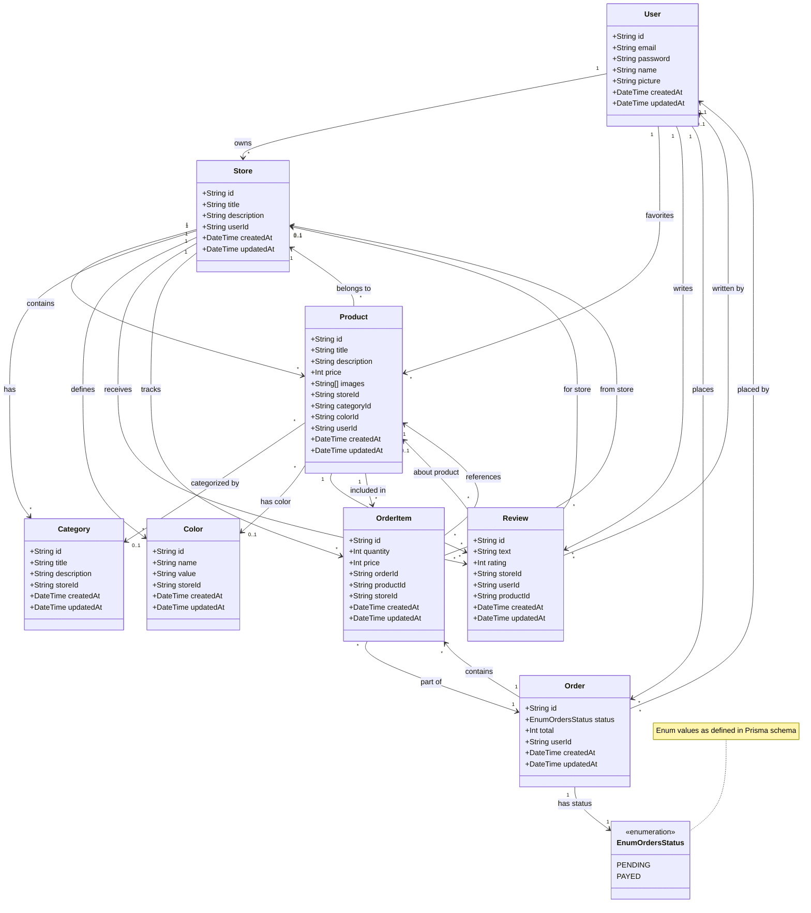

# Class Diagram

Alternative view of the database schema as a class diagram.

## Class Diagram

## Relationships Summary

### One-to-Many Relationships
- **User → Store**: A user can own multiple stores
- **User → Product**: A user can favorite multiple products
- **User → Review**: A user can write multiple reviews
- **User → Order**: A user can place multiple orders
- **Store → Product**: A store can have multiple products
- **Store → Category**: A store can have multiple categories
- **Store → Color**: A store can define multiple colors
- **Store → Review**: A store can receive multiple reviews
- **Product → Review**: A product can have multiple reviews
- **Product → OrderItem**: A product can be in multiple order items
- **Order → OrderItem**: An order can contain multiple items

### Many-to-One Relationships
- **Store → User**: Many stores belong to one user
- **Product → Store**: Many products belong to one store
- **Product → Category**: Many products can belong to one category (optional)
- **Product → Color**: Many products can have one color (optional)
- **Category → Store**: Many categories belong to one store
- **Color → Store**: Many colors belong to one store
- **Review → User**: Many reviews written by one user
- **Review → Store**: Many reviews for one store
- **Review → Product**: Many reviews about one product
- **Order → User**: Many orders placed by one user
- **OrderItem → Order**: Many items belong to one order
- **OrderItem → Product**: Many order items reference one product
- **OrderItem → Store**: Many order items from one store

### Special Relationships
- **User ↔ Product**: Many-to-many relationship through favorites
- **Order → EnumOrdersStatus**: Enum relationship for order status tracking
