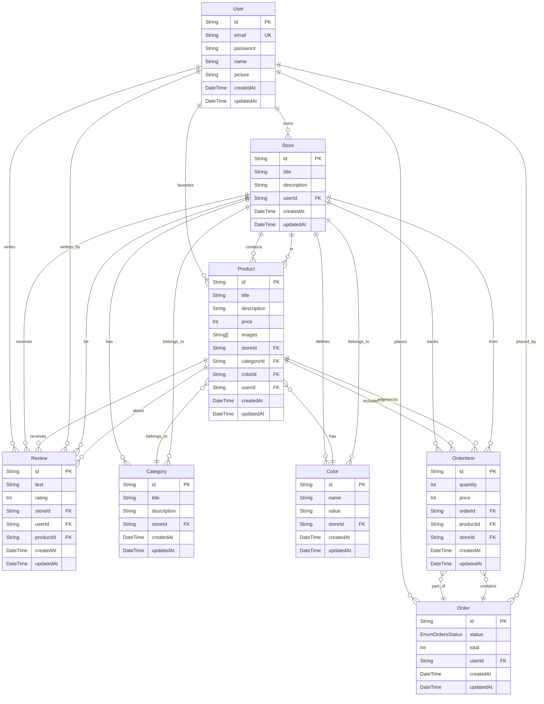

# Database Schema

This document contains the Entity Relationship Diagram (ERD) for the Store with CMS application database.

## Entity Relationship Diagram

## Model Descriptions

### User
Represents users of the system who can:
- Own and manage stores
- Mark products as favorites
- Write reviews
- Place orders

### Store
Represents online stores that:
- Are owned by users
- Contain multiple products
- Define categories and color schemes
- Receive reviews

### Product
Represents items for sale that:
- Belong to a store and category
- Have a color and price
- Can be favorited by users
- Can receive reviews
- Are included in orders

### Category
Represents product categories within a store for organization.

### Color
Represents color options available for products in a store.

### Review
Represents user feedback that can be:
- Written by users
- Associated with stores or products
- Rated on a numeric scale

### Order
Represents customer orders with:
- Status tracking (PENDING/PAYED)
- Multiple order items
- Total price

### OrderItem
Represents individual items within an order, tracking:
- Product quantity
- Price at time of purchase
- Associated product and store

## Order Status Enum

- `PENDING`: Order has been placed but not yet paid
- `PAYED`: Order has been paid for
